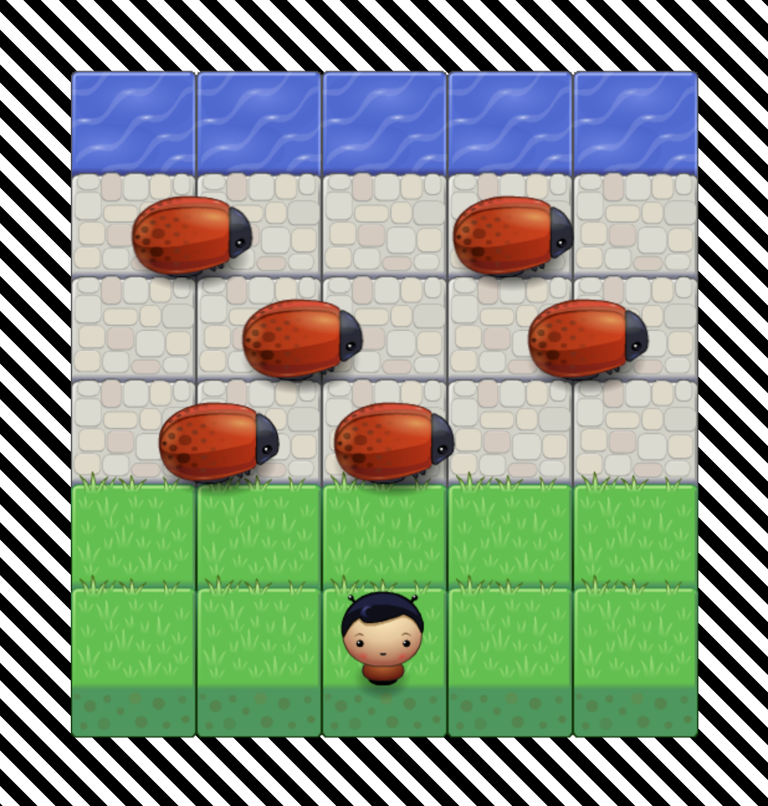

## ↘︎

In this Arcade Game you are a player and you need to stay away from your enemies - bugs. The goal of the player is to reach the water, without colliding into any one of the enemies. The player can move left, right, up and down. The enemies move in varying speeds on the paved block portion of the scene. Once a the player collides with an enemy, the game is reset and the player moves back to the start square. Once the player reaches the water the game is won.

## How The Game Is Played

1. Choose your character.
2. Place your fingers on arrows located on your keyboard. 
3. Analyse movement of your enemies.
4. Build a strategy in your mind.
5. Run!

## What The Player Is Expect From The Game

- Be happy - it's just a game, you have three lives to become a hero.
- Be focused - the bugs are programmed, try to understand the algorithm behind them.
- Be proud - if you finish the game without receving an alert: "GAME OVER", chapeau bas!

## Characters To Choose

## Hint

Haste makes waste.

## Resources

* [Engine](https://eu.udacity.com/course/front-end-web-developer-nanodegree--nd001)
* [Background](https://css-tricks.com/stripes-css/)